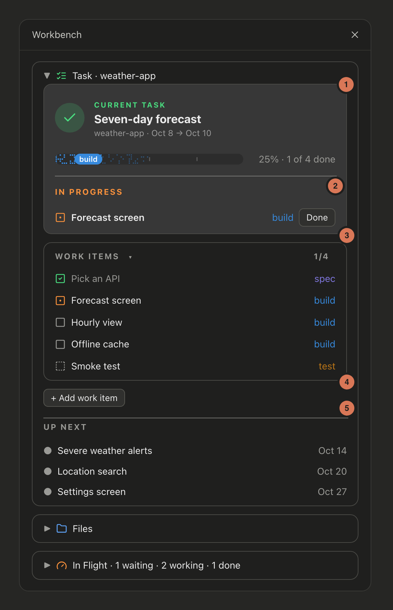
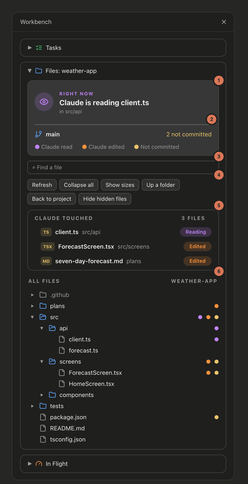
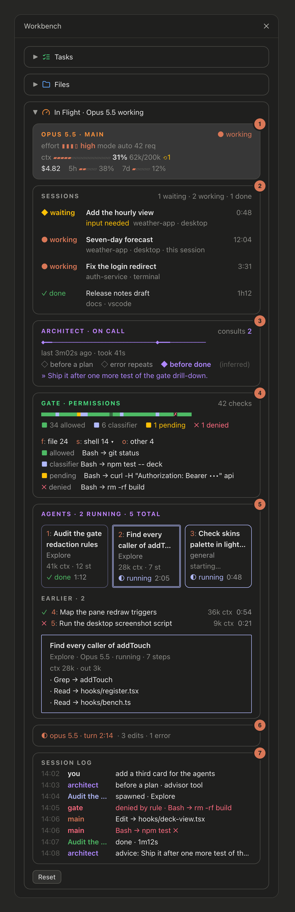

# Workbench

A Claude Code mod that keeps your work in view while Claude works. A band above the prompt shows your current task and its progress. A side pane holds three boxes:

- **Tasks:** the current task, its work items and what's up next, kept as plain markdown files in your project.
- **Files:** what Claude is reading or editing right now, your branch and uncommitted changes, every file Claude touched and a file tree.
- **In Flight:** the model, context and cost, every permission check, your subagents and a log of the session.

No accounts, no services, no network calls.


<sub>Mockups drawn with the mod's own drawing code and sample data.</sub>

## Install

Needs Claude Code 2.1.287 or later, in a terminal or the desktop app's Code tab.

```
/plugin marketplace add eascendco/workbench
/plugin install workbench@eascend
```

Start a new session and the pane opens. Then start your first task:

```
/task new Seven-day forecast
```

## The pane

Three boxes, each collapsing to one row with its arrow, icon or title. Tasks starts open, Files and In Flight closed, and the pane remembers what you left. The arrow at the end of the band opens and closes the pane. In the desktop app the pane draws icons; in a terminal it uses plain text.

### Tasks

Your current task and what's left on it. See [How tasks work](#how-tasks-work) for the files behind it.



1. **Current task.** Its title, project and dates, and a progress bar in the color of the current stage, with the percent and how many items are done.
2. **In progress.** The items you're working on now. **Done** marks one finished.
3. **Work items.** Every item with its stage. Click an item's square to move it along: draft, to do, in progress, done. The small arrow folds the list.
4. **Add work item.** Type a title, or `stage: title` to pick the stage.
5. **Up next.** The next three open tasks by date.

### Files

What Claude is doing in your project, and the project itself.



1. **Right now.** What Claude is doing this turn: reading or editing a file, running a command, searching, or thinking. Between turns it shows the last file Claude touched.
2. **Branch and changes.** Your git branch and how many files aren't committed, with the key for the dots below.
3. **Find a file.** Searches every file in the project as you type. Enter opens the first match in the tree.
4. **Tree buttons.** Refresh, collapse all, show sizes, go up a folder, go back to the project, show or hide hidden files.
5. **Claude touched.** The last five files Claude read or edited this session, with their folder and whether it's reading or edited them.
6. **All files.** The project tree. Dots mark files Claude read (purple) or edited (orange) and files not yet committed (yellow). A folder shows the dots of what's inside it.

### In Flight

What Claude and its subagents are doing right now, adapted from [claude-flightdeck](https://github.com/scasella/claude-flightdeck) by Stephen Casella (MIT). It only watches: it never blocks or changes a tool call.



1. **Main.** The model, whether it's working, effort, permission mode and requests so far. The context gauge (⟲ counts compactions), the session's cost and your 5-hour and 7-day limits.
2. **Architect.** Shows up once Claude consults an advisor or architect agent: each consult on a timeline, when it happened (before a plan, after repeated errors, before done; inferred), and the last advice.
3. **Gate.** One square per permission check. Green was allowed by your settings, blue by the auto-mode classifier or you, amber is waiting for you, red ✗ was denied; checks inside subagents are dimmed. `file`, `shell` and `other` open the last five checks of that kind, with credentials masked.
4. **Agents.** The three newest subagents as tiles: task, type, context, steps, status and a running clock. Earlier ones are listed below. Press one to see its last tool calls and the start of its answer.
5. **Turn.** The turn in progress with its clock, edits and errors, or a receipt for the last one with its cost.
6. **Session log.** Prompts, spawns, consults, edits, errors and denials as they happen.

Panels with nothing to show take no room, and **Reset** clears the box. It reads its data only while open.

## How tasks work

Each task is one file in `plans/` at your project root. `/task new <title>` writes one for you:

```markdown
---
task: seven-day-forecast
project: weather-app
short: weather-app
title: Seven-day forecast
date: 2026-10-08
end: 2026-10-08
status: open
---

# Seven-day forecast

## Work items

- [x] Pick an API `spec`
- [~] Forecast screen `build`
  Seven days, with the hourly view behind a tap.
- [ ] Offline cache `build`
- [?] Release build `ship`
```

- `[ ]` to do, `[~]` in progress, `[x]` done, `[?]` a draft waiting for your approval.
- The word in backticks is the stage: `spec`, `design`, `build`, `track`, `test` or `ship`.
- Indented lines under an item are its details.
- The current task is the earliest open plan by `date`. The next three are Up next.
- When every item is done, the plan's `status` becomes `done` and the next task moves up.
- Anything else in the file, like a `## Notes` section, is kept as you wrote it.

Claude gets a `work_items` tool to create tasks, add items and update their status. Ask it to "break this task down" and it adds draft items for you to approve.

## Commands

| Command | What it does |
|---|---|
| `/task` | The current task, its work items and Up next |
| `/task new <title>` | Start a task |
| `/task <n>` | One work item with its details |
| `/task start <n>`, `/task done <n>`, `/task reopen <n>` | Change an item's status |
| `/task approve [n]` | Approve one draft, or all of them |
| `/task add [stage:] title -- details` | Add a work item |
| `/task break` | Ask Claude to draft the work items |
| `/task pane` | Open the side pane |
| `/task <anything else>` | Ask Claude, with the task and its plan file attached |

## Settings

In `/config`, under Workbench:

- **Plans folder:** the folder name for plan files. Default `plans`.
- **Open the pane at start:** `on` or `off`.
- **Band above the prompt:** `on` or `off`.
- **Match macOS light and dark:** `on` keeps Claude Code's theme on light or dark to match macOS, checked every 5 seconds (a daltonized or ANSI variant keeps its kind). `off` leaves the theme alone. Does nothing off macOS.

## Works with skins

If you use the [skins](https://github.com/hellosverre/claude-skins) mod, the pane takes its colors from your active skin, light or dark. Skins pick light or dark from Claude Code's theme setting, which the desktop app doesn't change when macOS switches; the Match macOS setting above keeps them in step. Without skins, the pane uses its own colors.

## What it reads

Your plan files, folder listings for the tree, and `git status` for the branch and changes. In Flight reads the session's own events (tool calls and their permission verdicts, subagent steps, context and cost) and keeps short summaries for the session only. It reads no file contents beyond the plan files, makes no network calls, and stores nothing outside your project. Run `claude plugin validate` on this folder to see every call it makes.

## Turn it off

Disable it in `/plugin` under Installed, or:

```
claude plugin disable workbench@eascend
```

## License

MIT. Made by [eascend](https://eascend.co). The In Flight box is adapted from [claude-flightdeck](https://github.com/scasella/claude-flightdeck), MIT, Copyright (c) 2026 Stephen Casella; its notice is in `hooks/deck.ts`.
