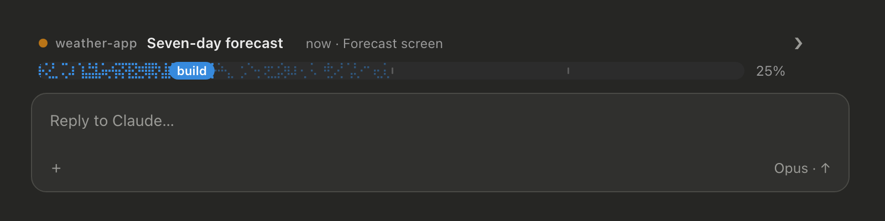
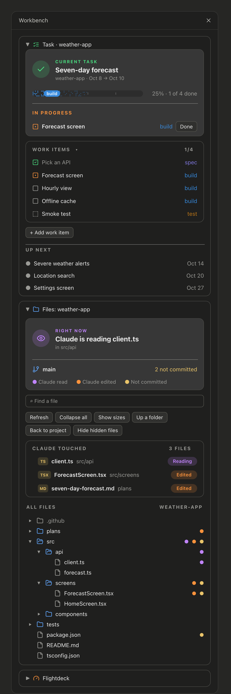

# Workbench

A Claude Code mod that keeps your current task in view while Claude works. A band above the prompt shows the task and its progress. A side pane shows the task's work items, what Claude is reading and editing right now, your git branch, and a file tree.

Tasks are plain markdown files in a `plans/` folder in your project. You edit them by hand, with `/task`, or Claude edits them as it works. No accounts, no services, no network calls.





<sub>Mockups drawn with the mod's own drawing code and sample data.</sub>

## Install

Needs Claude Code 2.1.287 or later, in a terminal or the desktop app's Code tab.

```
/plugin marketplace add eascendco/workbench
/plugin install workbench@eascend
```

Start a new session and the pane opens. Then start your first task:

```
/task new Seven-day forecast
```

## How tasks work

Each task is one file in `plans/` at your project root. `/task new <title>` writes one for you:

```markdown
---
task: seven-day-forecast
project: weather-app
short: weather-app
title: Seven-day forecast
date: 2026-10-08
end: 2026-10-08
status: open
---

# Seven-day forecast

## Work items

- [x] Pick an API `spec`
- [~] Forecast screen `build`
  Seven days, with the hourly view behind a tap.
- [ ] Offline cache `build`
- [?] Release build `ship`
```

- `[ ]` to do, `[~]` in progress, `[x]` done, `[?]` a draft waiting for your approval.
- The word in backticks is the stage: `spec`, `design`, `build`, `track`, `test` or `ship`.
- Indented lines under an item are its details.
- The current task is the earliest open plan by `date`. The next three are Up next.
- When every item is done, the plan's `status` becomes `done` and the next task moves up.
- Anything else in the file, like a `## Notes` section, is kept as you wrote it.

Claude gets a `work_items` tool to create tasks, add items and update their status. Ask it to "break this task down" and it adds draft items for you to approve.

## Commands

| Command | What it does |
|---|---|
| `/task` | The current task, its work items and Up next |
| `/task new <title>` | Start a task |
| `/task <n>` | One work item with its details |
| `/task start <n>`, `/task done <n>`, `/task reopen <n>` | Change an item's status |
| `/task approve [n]` | Approve one draft, or all of them |
| `/task add [stage:] title -- details` | Add a work item |
| `/task break` | Ask Claude to draft the work items |
| `/task pane` | Open the side pane |
| `/task <anything else>` | Ask Claude, with the task and its plan file attached |

## The pane

**Task box.** The current task with a progress bar and what's in progress. The work items, where clicking an item's square moves it along. A `+ Add work item` button. Up next.

**Files box.** What Claude is reading or editing right now, your branch and how many files aren't committed. Find a file, with buttons to refresh, collapse all, show sizes, go up a folder, go back to the project and show or hide hidden files. Every file Claude touched this session. The file tree, with a dot on files Claude read or edited and on files not yet committed.

**Flightdeck.** A live agent dashboard, ported from [claude-flightdeck](https://github.com/scasella/claude-flightdeck) by Stephen Casella (MIT) and stacked for one column. The main model's effort, context, cost and rate limits. Consults with an advisor or architect agent. Every permission check, with totals and a drill-down per tool family (credentials masked). Subagents as cards, or lanes on one time axis when there are several; press one to see its last tool calls. The current or last turn, and a session log. It only watches: it never blocks or changes a tool call.

Each box collapses to one row. Tasks starts open, Files and Flightdeck closed, and the pane remembers what you left.

The arrow at the end of the band opens and closes the pane. In the desktop app the pane draws icons; in a terminal it uses plain text.

## Settings

In `/config`, under Workbench:

- **Plans folder:** the folder name for plan files. Default `plans`.
- **Open the pane at start:** `on` or `off`.
- **Band above the prompt:** `on` or `off`.

## Works with skins

If you use the [skins](https://github.com/hellosverre/claude-skins) mod, the pane takes its colors from your active skin, light or dark. Without it, the pane uses its own colors.

## What it reads

Your plan files, folder listings for the tree, and `git status` for the branch and changes. Flightdeck reads the session's own events (tool calls and their permission verdicts, subagent steps, context and cost) and keeps short summaries for the session only. It reads no file contents beyond the plan files, makes no network calls, and stores nothing outside your project. Run `claude plugin validate` on this folder to see every call it makes.

## Turn it off

Disable it in `/plugin` under Installed, or:

```
claude plugin disable workbench@eascend
```

## License

MIT. Made by [eascend](https://eascend.co). The Flightdeck box is adapted from [claude-flightdeck](https://github.com/scasella/claude-flightdeck), MIT, Copyright (c) 2026 Stephen Casella; its notice is in `hooks/deck.ts`.
